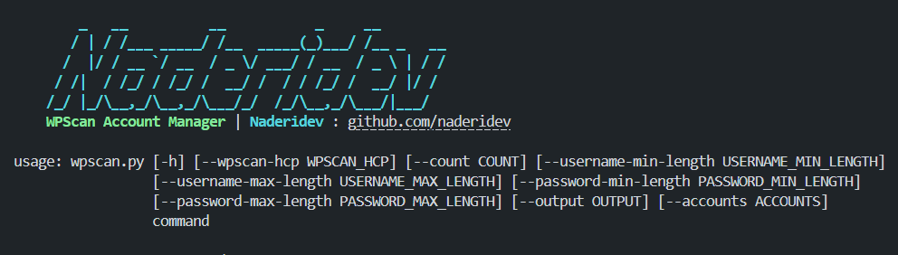

# WPScan Account Manager


A Python tool to automate the creation and management of WPScan accounts for bypassing the WPScan Free Plain API Limitations. This tool helps in creating multiple WPScan accounts and manages API token rotation for scanning WordPress websites.

## Features

- 🚀 Automated WPScan account creation
- 📧 Automatic email verification
- 🔄 API token rotation for multiple accounts
- 📊 Progress tracking with rich console output
- 🎯 Command-line interface for easy integration

## Requirements

- Python 3.6+
- `requests`
- `rich`

## Installation

1. Clone the repository:
```bash
git clone https://github.com/naderidev/wpscan-account-manager.git
cd wpscan-account-manager
```

2. Install the required packages:
```bash
pip install requests rich
```

## Usage

### Creating Accounts

To create new WPScan accounts:

```bash
python wpscan.py create-account --wpscan-hcp YOUR_HCP_TOKEN [options]
```

Options:
- `--count`: Number of accounts to create (default: 1)
- `--username-min-length`: Minimum username length (default: 12)
- `--username-max-length`: Maximum username length (default: 16)
- `--password-min-length`: Minimum password length (default: 15)
- `--password-max-length`: Maximum password length (default: 30)
- `--output`: Output file path (default: accounts.json)

### Running WPScan with Account Rotation

To use WPScan with automatic account rotation:

```bash
python wpscan.py scan --accounts accounts.json [wpscan options]
```

The tool will automatically:
1. Load accounts from the specified file
2. Rotate to the next account
3. Run WPScan with the current account's API token

## Features in Detail

### Account Creation
- Generates random usernames and secure passwords
- Uses temporary email service for verification
- Handles email verification automatically
- Retrieves API tokens after account activation

### Account Management
- Stores accounts in JSON format
- Includes email, password, and API token
- Maintains rotation index for fair usage
- Handles account rotation automatically

## Contributing

Contributions are welcome! Please feel free to submit a Pull Request.

## License

This project is licensed under the MIT License - see the LICENSE file for details.

## Author

[Naderidev](https://github.com/naderidev)

## Disclaimer

This tool is intended for legitimate security testing purposes only. Users are responsible for complying with WPScan's terms of service and usage policies.
